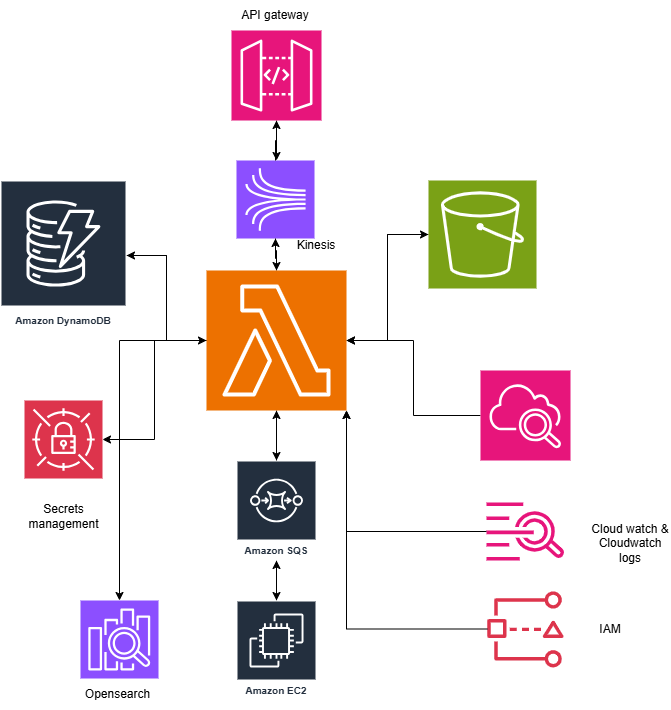
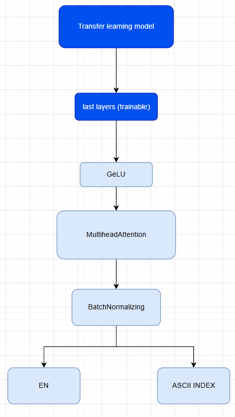

# Sentient Planner - Emotion to Daily Routine Planner

>  An AI-powered backend that transforms raw, unstructured thoughts into structured weekly plans with ASCII art visualization of emotional states.

## Overview

Sentient Planner analyzes your text input using **Gemini 2.5 Flash** to:
1. **Detect your emotional state** - Understand the underlying sentiment
2. **Generate a weekly plan** - Create a tailored, pragmatic schedule
3. **Visualize the emotion** - Convert feelings into ASCII art using PyTorch

CLOUD ARCHITECTURE



DEEP LEARNING MODEL


```
┌─────────────────────────────────────────────────────────────┐
│                    SENTIENT PLANNER                          │
├─────────────────────────────────────────────────────────────┤
│                                                              │
│   User Input  ──▶  Gemini AI  ──▶  Weekly Plan              │
│       │                │              │                      │
│       │                ▼              ▼                      │
│       └──────▶  Emotion Detection  ──▶  ASCII Art Worker    │
│                                            │                 │
│                                            ▼                 │
│                                      ╰(*´︶`*)╯              │
│                                                              │
└─────────────────────────────────────────────────────────────┘
```

##  Architecture

This project uses **LocalStack** to simulate AWS services locally:

| AWS Service | Local Simulation | Purpose |
|-------------|------------------|---------|
| API Gateway | LocalStack APIGW | Entry point, routing |
| Lambda | LocalStack Lambda | Auth & Core Logic |
| Kinesis | LocalStack Kinesis | Input streaming buffer |
| DynamoDB | LocalStack DynamoDB | Plans & emotion storage |
| SQS | LocalStack SQS | ASCII generation queue |
| S3 | LocalStack S3 | ASCII art storage |
| Secrets Manager | LocalStack SM | API keys & JWT secret |
| EC2 | Docker Container | ASCII generation worker |

##  Project Structure

```
Emotion-to-daily-routine-planner/
├── deployment/
│   └── terraform/          # Infrastructure as Code
│       ├── main.tf
│       ├── variables.tf
│       └── outputs.tf
├── src/
│   ├── lambdas/
│   │   ├── auth/           # JWT Authorizer
│   │   ├── processor/      # Core orchestrator (Gemini + DB)
│   │   └── plan_api/       # GET /plan endpoint
│   └── worker/             # ASCII generation container
│       ├── worker.py
│       ├── Dockerfile
│       └── requirements.txt
├── ascii_model/            # PyTorch model for ASCII classification
│   ├── train.py
│   ├── train.csv
│   └── ...
├── scripts/
│   ├── setup.ps1          # Windows setup script
│   ├── setup.sh           # Unix setup script
│   ├── test_infrastructure.py
│   └── generate_token.py
├── docker-compose.yml
└── .env.example
```

##  Quick Start

### Prerequisites

- **Docker Desktop** (with Docker Compose)
- **Terraform** >= 1.5.0
- **Python** >= 3.10
- **tflocal** (LocalStack Terraform wrapper): `pip install terraform-local`
- **awslocal** (LocalStack AWS CLI): `pip install awscli-local`

### 1. Clone and Setup

```bash
# Clone the repository
cd d:\Projects\Localstack-Projects\Emotion-to-daily-routine-planner

# Copy environment file
cp .env.example .env
# Edit .env with your Gemini API key
```

### 2. Start LocalStack

```bash
docker-compose up -d localstack
```

### 3. Deploy Infrastructure (Windows PowerShell)

```powershell
.\scripts\setup.ps1
```

Or manually:

```bash
cd deployment/terraform
tflocal init
tflocal apply -auto-approve

# Seed secrets
awslocal secretsmanager put-secret-value \
    --secret-id app-secrets \
    --secret-string '{"GEMINI_KEY":"your-key","JWT_SECRET":"your-secret"}'
```

### 4. Start the Worker

```bash
docker-compose up -d --build sentiment-worker
```

### 5. Test the API

```bash
# Generate a JWT token
python scripts/generate_token.py --user-id user1 --secret YOUR_JWT_SECRET --curl

# Send a request
curl -X POST "http://localhost:4566/restapis/{API_ID}/dev/_user_request_/analyze" \
  -H "Content-Type: application/json" \
  -H "Authorization: Bearer {YOUR_TOKEN}" \
  -d '{"text": "I am feeling stressed about deadlines but excited about my new project", "userId": "user1"}'

# Get your plan
curl "http://localhost:4566/restapis/{API_ID}/dev/_user_request_/plan/user1" \
  -H "Authorization: Bearer {YOUR_TOKEN}"
```

## 🔧 API Endpoints

### POST /analyze
Submit text for analysis and plan generation.

**Headers:**
- `Authorization: Bearer <jwt_token>`
- `Content-Type: application/json`

**Body:**
```json
{
  "text": "Your thoughts and feelings here...",
  "userId": "unique-user-id"
}
```

**Response:**
```json
{
  "message": "Request accepted for processing",
  "requestId": "abc123"
}
```

### GET /plan/{userId}
Retrieve generated plans for a user.

**Headers:**
- `Authorization: Bearer <jwt_token>`

**Response:**
```json
{
  "userId": "user1",
  "planCount": 1,
  "plans": [
    {
      "recordId": "uuid",
      "emotion": "stressed",
      "sentimentScore": 45,
      "weeklyPlan": [...],
      "ascii": {
        "status": "completed",
        "url": "http://localhost:4566/sentient-planner-bucket/ascii-art/..."
      }
    }
  ]
}
```

##  Testing

Run infrastructure tests:

```bash
python scripts/test_infrastructure.py
```

##  Circuit Breaker Pattern

The system implements graceful degradation:
- If the ASCII Worker fails, users still receive their weekly plan
- Plans are returned with `"ascii.status": "pending"` until visualization is ready
- The system never blocks plan delivery due to visual generation delays

##  ASCII Art Emotions

The worker generates ASCII art based on detected emotions:

| Emotion | Sample |
|---------|--------|
| Happy | `╰(*´︶`*)╯` |
| Anxious | `(・_・;)` |
| Stressed | `(╯°□°)╯︵ ┻━┻` |
| Sad | `(｡•́︿•̀｡)` |
| Neutral | `(・_・)` |

## 📝 Development

### Training the ASCII Model

```bash
cd ascii_model
python train.py
```

### Viewing Logs

```bash
# LocalStack logs
docker-compose logs -f localstack

# Worker logs
docker-compose logs -f sentiment-worker
```

## License

MIT License - see LICENSE file for details.

---


